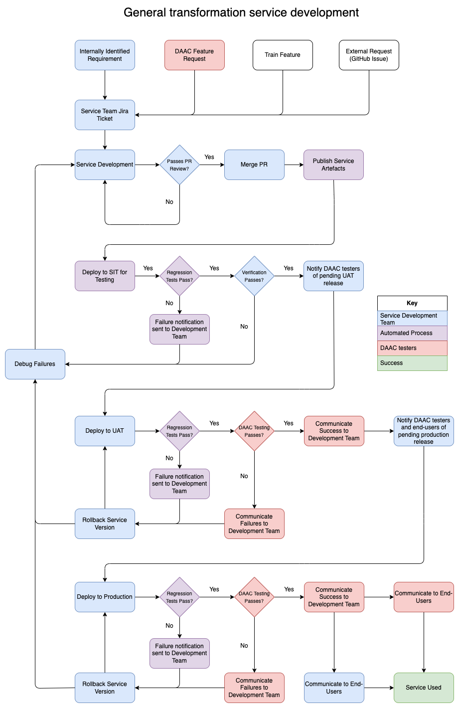
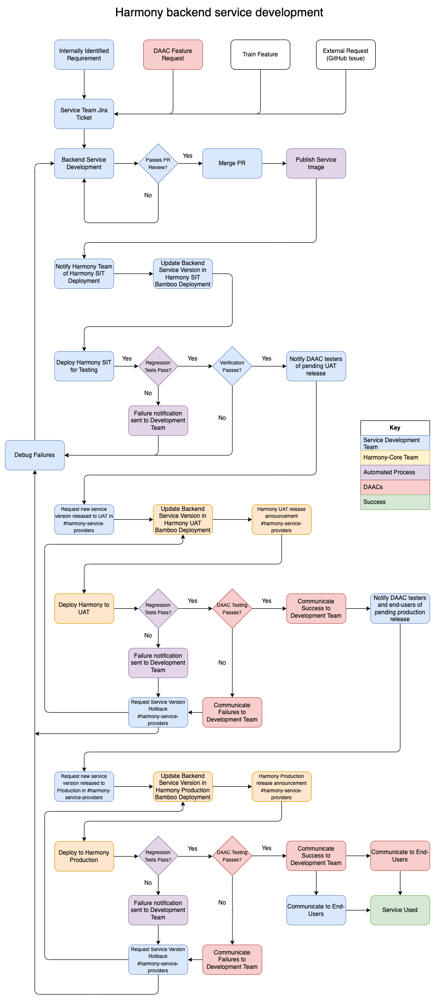

The Harmony service development workflow includes unique interactions between the Harmony Core and Harmony backend service development teams (see @fig-harmony-service). As such, both a generalized and Harmony-specific feature workflow are illustrated below.

### Publishing and releasing a new version of a service:

Data providers and testers at the DAACs need to be able to easily understand the features (tickets) contained in each release of a service. To achieve this:

* Please include commit history in the GitHub release notes. For an example on release note generation, please see [this script](https://github.com/nasa/harmony-regridding-service/blob/main/bin/extract-release-notes.sh).
* When announcing a release of a published service version to a Harmony environment in the harmony-service-providers Slack channel, please either include the exact release notes from GitHub and/or include a link to the GitHub release page.
* On each Jira ticket adding, removing or changing a feature in a service, please indicate the service version that those changes are included in via a comment or other mechanism.

### Deployment Cycle:

* SIT - should receive all new published artefacts in order to allow service maintainers to test the new version of the service.
* UAT - artefacts will be promoted to UAT on successful SIT testing.
* Production - artefacts to be promoted to production following successful stakeholder testing in UAT or 2 weeks, whichever is sooner. **Exception: failed tests in UAT blocks promotion to production.**

### Workflow:

{#fig-general-service}

{#fig-harmony-service}
