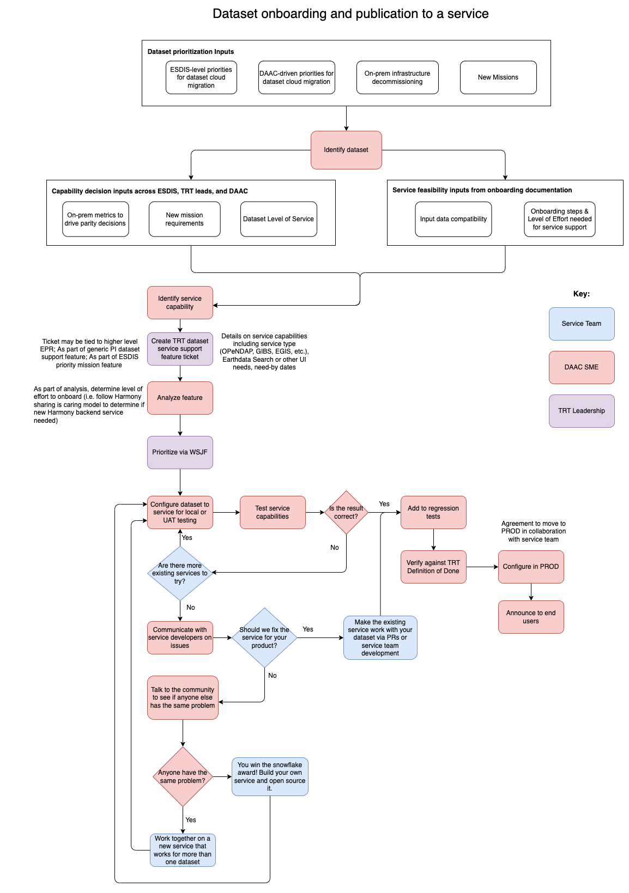

The following workflow diagram is adopted from the [Harmony dataset onboarding model](https://wiki.earthdata.nasa.gov/display/HARMONY/Onboarding+a+new+dataset), in this case more generalized across Earthdata cloud data services and broadened to include DAAC prioritization and SAFe feature development process.

### Workflow

{#fig-new-dataset}
