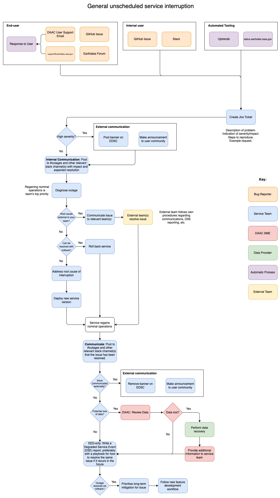

## What is an interruption?

An interruption could be either scheduled, for example due to scheduled maintenance or redeployment of an application, or it could be unscheduled, when an unexpected issue arises in either the application or an upstream component. Scheduled interruptions should be kept to a minimum (both in frequency and duration), and our infrastructure should be designed to prevent the need for such interruptions where possible. While the workflow is unique for a scheduled versus unscheduled interruption, there is a similar emphasis on the need for pre and post interruption communication, along with testing and validation.

## Unscheduled interruptions

Where possible service development should embrace the basic Agile quality practice of shifting learning left (https://scaledagileframework.com/built-in-quality/). While unexpected interruptions or bugs will occur, their impact can be mitigated by rigorous testing prior to, during and after deployment, along with health checks and metric gathering. The desired outcome is to identify and mitigate unscheduled interruptions as soon as possible, preferably before end-users encounter them.

### Discovering an unscheduled interruption:

The following mechanisms for discovery of an unscheduled service interruption are loosely ordered from the earliest point at which an issue arises:

* Health checks in UAT and production environments. (E.g., CloudWatch and/or Cloud Metrics. Potentially also configured to report to the [Status Application](https://status.earthdata.nasa.gov); see [onboarding documentation](https://status.earthdata.nasa.gov/documentation/integration)).
* Data provider testing (in UAT and production).
* Internal Slack messages from other EOSDIS teams. Each service should provide clear guidance to these teams to know where they can reach out for help.
* User reported issue via:
  * [Earthdata Forum](https://forum.earthdata.nasa.gov/)
  * GitHub issues
  * Earthdata support email (support@earthdata.nasa.gov)

### Workflow

{#fig-unscheduled-interruption}
